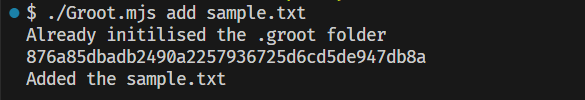
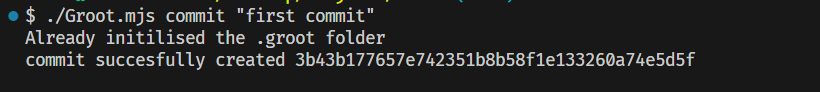
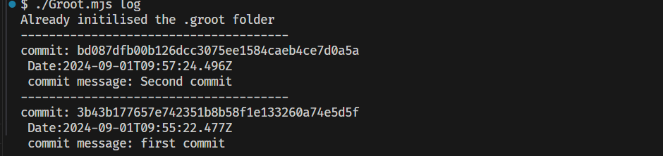
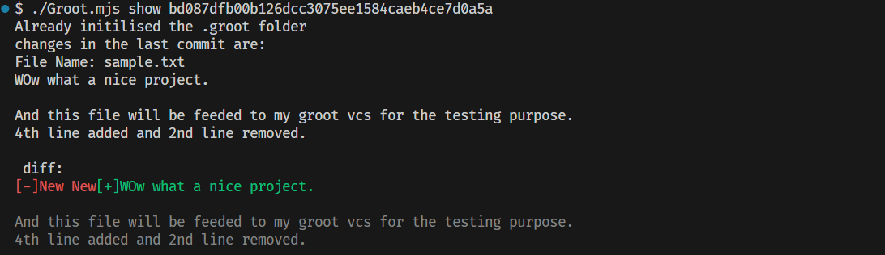

## GROOT - Personal Version Control System

Welcome to Groot, a powerful development tool for managing and organizing your projects.

### Features
* We can initilise a repo.
* Files can be added to the staging area.
* Fromt the staging area we can commit our changes with our custom messages.
* We can see our logs. That what all commits we have done so far.
* We can compare the changes in the files that have been done between the two commits.
* It show the diffs in the files in really attractive manner by showing a iteractive colors to the lines of the files.


## Getting Started
* Just Clone the repo in your personal compurer.
* create some files that you want to track. By default I have created a sample.txt file, You can create your own of your choice.
*Now in order to initilise the repo run this command in your terminal.
```
 ./Groot.mjs init       
```
* Now your repo has been initialised and it can be tracked by the Groot.
* In order to add the file to the staging area you can follow this command in your terminal.
```
./Groot.mjs add <Your file name>

```
this will show a message on your terminal as :
* You can add more files to the staging area by just following the above steps.

* You can commit your changes by :
```
./Groot.mjs commit "first commit"

```


* You can see your logs by just writing this command in terminal
```
./Grooot.mjs log
```
your logs will be displayed as follows:



* Inorderd to see the diffs of the two commits you have to get the hash code of the commits that you can get form the logs that you have displayed.copy the hash code. Then follow this:
```
./Groot.mjs show <Your Hash Code that you have copied>
```

* The diffs of the two commits will be shown as :



In the above message 
* The one which is show in red color with [-] tag is the conent that you have removed form the previous commit
* And the one with Green color [+] tag is the content that you have added to your file.
* And the one with grey color is the content that has not been changed form the previous commit to the current commit.


